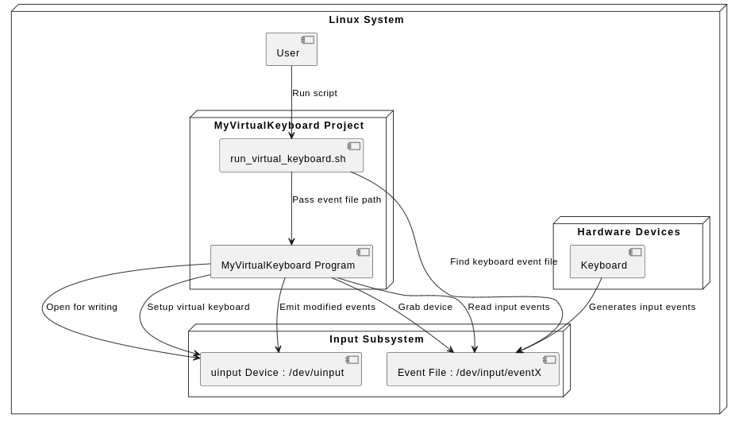

# my-virtual-keyboard 

This project contains a simple virtual keyboard implementation for Linux, utilizing the uinput and input subsystems. It reads input events from a specified input device and can emit customized events using a callback mechanism.


  

## Requirements

- Linux operating system
- g++ compiler
- Linux kernel headers (for uinput)

## Build Instructions

1. Install the necessary packages:

```bash
sudo apt-get update
sudo apt-get install build-essential linux-headers-$(uname -r)
```

2. Clone the repository or download the source files to your local machine.

3. Navigate to the directory containing the source files.

4. Compile the program using `make`:

```bash
make
```

## Run Instructions

1. Ensure you have read permissions to the input event file and write permissions to `/dev/uinput`. You may need to run the program as root or adjust permissions accordingly.

2. Run the executable with:

```bash
# example
sudo ./MyVirtualKeyboard /dev/input/event3
```

## Customization

The program can be customized by modifying the callback function in the `main` function. The example provided changes the `KEY_A` event to a `KEY_S` event:

```cpp
keyboard.run([&keyboard](const input_event &ie) {
    if (ie.type == EV_KEY)
    {
        keyboard.emit(ie.type, ie.code == KEY_A ? KEY_S : ie.code, ie.value);
    }
    else
    {
        keyboard.emit(ie.type, ie.code, ie.value);
    }
});
```

You can modify this logic to implement your own event handling rules.

## Clean Up

To remove the compiled files, run:

```bash
make clean
```

## Potential Issues
If your keyboard has an integrated touchpad, using EVIOCGRAB to grab the keyboard input device may cause the touchpad to stop functioning. This is because EVIOCGRAB captures all input events from the device, preventing other processes from receiving touchpad events. In such cases, you may need to find a balance between using EVIOCGRAB and maintaining touchpad functionality or consider alternate methods of handling input events.


## Reference
https://docs.kernel.org/input/event-codes.html  

## License

This project is licensed under the MIT License.

## Disclaimer

This software is provided "as-is" without any warranties. The author is not responsible for any damage caused by using this software. Use at your own risk.

